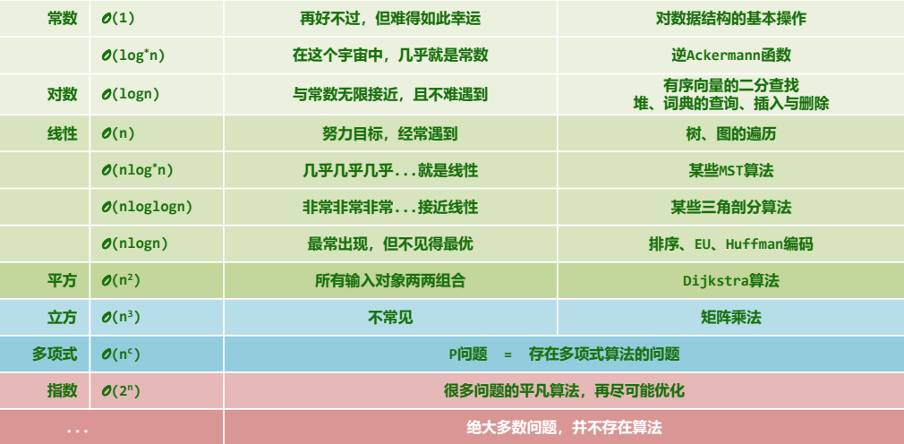

## DSA = Data Structure + Algorithm 

##  度量

To measure is to know. If you can not measure it, you can not improve it.   - Lord Keivin

## 算法分析

- 正确性
- 成本：运行时间 + 存储空间

时间复杂度：n规模的最坏情况
抽象出一个理想的平台或者模型，算法的时间转化为理想模型上的计算次数（执行基本指令的总条数）

**TM**：Turing Machine  图灵机
无限长的磁带

**RAM**：Random Access Machine
无限个存储器

**渐进分析**
悲观：大O记号（big-O notation）最坏情况估计
大Θ记号（big-theta notation） 准确估计
乐观：大Ω记号（big-omega notation）最好情况估计
在n足够大的时候，存在   $\Omega<T(n)=\Theta<O$

算法分析任务：正确性（不变性×单调性）+ 复杂度
C++等高级语言的**基本指令**，等效于常数条数的RAM基本指令，渐进意义上，二者大体相当

```c++
- 分支转向：`goto`  // 算法的灵魂；出于结构考虑，被隐藏了
- 迭代循环：for() while()  // 本质就是  **if + goto**
- 调用+递归（自我调用）  // 本质上也是** goto **

递归：递归方程+递推方程
猜测+验证
```


**封底估算**

- 复杂度计算  10^9 约等于 1秒 假定计算机是1GHz的主频
- 10^5^秒大致就是一天，一天实际是86400秒
- 10^10^秒大约就是三生三世， 3个世纪

**时间复杂度列表**

O(1)、O(log^*^n)、O(loglogn)、O(logn)、O(sqrt(n))、O(n)、O(nlog^*^n)、O(nloglogn)、O(nlogn)、O(n^2^)、O(n^3^)、O(n^c^)、O(2^n)



**迭代：级数求和**

```c++
算数级数：与末项平方同阶            T(n)=1+2+3+4+...+n=n(n+1)/2=O(n^2)
幂方级数：比幂次高出一阶            T3(n)=1^3+2^3+...+n^3=(n^2(n+1)^2)/4=O(n^4)
几何级数（a>1）：与末项同阶         Ta(n)=a^0+a^1+a^2+...+a^n=(a^(n+1)-1)/(a-1)=O(a^n)
收敛级数：常数                     T(n)=1+1/(2^2)+1/(3^2)+...+1/(n^2)=π^6/6=O(1)
```

- 算数级数：与末项平方同阶 
  $T(n)=1+2+3+4+...+n=\cfrac{n(n+1)}{2}=O(n^2)$

- 幂方级数：比幂次高出一阶 
  $T_3(n)=1^3+2^3+...+n^3=\cfrac{(n^2(n+1)^2)}{4}=O(n^4)$

- 几何级数（a>1）：与末项同阶 
  $T_a(n)=a^0+a^1+a^2+...+a^n=\cfrac{a^{n+1}-1}{a-1}=O(a^n)$

- 收敛级数：常数
  $T(n)=1+\cfrac{1}{2^2}+\cfrac{1}{3^2}+...+\cfrac{1}{n^2}=\cfrac{π^6}{6}=O(1)$

- 几何分布
  $(1-\lambda)[1+2\lambda^2+3\lambda^3+4\lambda^4+...]=\cfrac{1}{1-\lambda}=O(1)$

- 可能未必收敛，但是有限
  调和级数  $h(n)=\sum_{k=1}^{n}\cfrac{1}{k}=1+\cfrac{1}{2}+\cfrac{1}{3}+...+\cfrac{1}{n}=\ln_{}{n}+\gamma+O(\cfrac{1}{2n})=\Theta(\log_{}{n})$
  对数级数  $\sum_{k=1}^{n}\ln_{}{k}=\ln_{}{1}+\ln_{}{2}+\ln_{}{3}+...+\ln_{}{n}=\ln_{}{\prod_{k=1}^{n}k}=\ln_{}{n!}\approx(n+0.5)·\ln_{}{n}-n=\Theta(n\log_{}{n})$

- 对数+线性+指数
  $\sum_{k=1}^{n}k\log_{}{k}\approx\int_{1}{n}x\ln_{}{x}\mathrm{d}x=\cfrac{x^2·(2·\ln_{}{x}-1)}{4}\Big|_{1}^{n}=O(n^{2}\log_{}{n})$

  $\sum_{k=1}^{n}k·2^{k}=\sum_{k=1}^{n}k·2^{k+1}-\sum_{k=1}^{n}k·2^{k}=\sum_{k=1}^{n+1}(k-1)·2^{k}-\sum_{k=1}^{n}k·2^{k}=n·2^{n+1}-\sum_{k=1}^{n}2^{k}$$=n·2^{n+1}-(2^{n+1}-2)=(n-1)·2^{n+1}+2=O(n·2^n)$


**递归跟踪（Recursion Trace）**：绘出计算过程中出现的所有递归实例（及其调用关系），它们各自所需时间之总和，即为运行时间。

**递推方程（Recursion Recurrence）**：从递推的角度看，为求解规模为n的问题， //T(n)。递归求解规模为n-1的问题，//T(n-1)。再累加上A[n - 1] //O(1)

递归跟踪：直观形象，仅适用于简明的递归模式
递推方程：间接抽象。更适用于复杂的递归模式

- Decrease-and-conquer：划分为一个平凡、一个规模缩减的两个子问题，递归的求解规模缩减的问题，直到足够小成为一个平凡的子问题（递归基），再由子问题的解，得到原问题的解
- Divide-and-conquer：为求解一个大规模问题，可以将其划分为若干个子问题（通常两个，规模大体相当），使用递归分别求解子问题，由子问题的解合并得到原问题的解

**主定理**：分治策略对应的递推式，通常（尽管不总是）形如：T(n)=a×T(n/b)+O(f(n))，原问题被分为a个规模为n/b的子任务；任务的划分、解的合并耗时为f(n)

$形如 T(n)=a·T(\cfrac{n}{b})+O(n^d),其中a、b、d都是常数的递推函数$
$如果\log_{b}{a}<d，复杂度为O(n^d)$
$如果\log_{b}{a}>d，复杂度为O(n^{\log_{b}{a}})$
$如果\log_{b}{a}=d，复杂度为O(n^d·{\log_{}{n}})$

- $若f(n)=O(n^{\log_{b}{a}-c})，则T(n)=\Theta(n^{log_{b}{a}})$
  **kd-search：**  $T(n)=2·T(\cfrac{n}{4})+O(1)=O(\sqrt{n})$
- $若f(n)=O(n^{\log_{b}{a}}·\log^k_{}{n})，则T(n)=\Theta(n^{log_{b}{a}}·\log^{k+1}_{}{n})$
  **binary-search：**  $T(n)=1·T(\cfrac{n}{2})+O(1)=O(\log_{}{n})$
  **mergesort：**  $T(n)=2·T(\cfrac{n}{2})+O(n)=O(n·\log_{}{n})$
  **STL mergesort：**  $T(n)=2·T(\cfrac{n}{2})+O(n·\log_{}{n})=O(n·\log^{2}_{}{n})$
- $若f(n)=O(n^{\log_{b}{a}+c})，则T(n)=\Theta(f(n))$
  **quickSelect(average case)：**  $T(n)=1·T(\cfrac{n}{2})+O(n)=O(n)$


